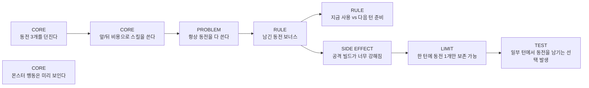

# Rule Evolution Board

## 목적

이 문서는 게임 규칙 아이디어가 어떻게 생기고, 실험되고, 유지/수정/폐기되는지 시각적으로 기록하기 위한 보드다.

핵심은 좋은 아이디어를 많이 쌓는 것이 아니라, 각 규칙이 어떤 문제를 해결하기 위해 생겼는지 추적하는 것이다.

```text
기본 규칙
-> 플레이 중 발견된 문제
-> 문제를 해결하기 위한 추가 규칙
-> 새로 생긴 선택
-> 부작용
-> 제한 또는 카운터
-> 테스트 결과
```

## 카드 타입

| 타입 | 색 추천 | 의미 |
| --- | --- | --- |
| CORE | 검정/진한색 | 핵심 규칙 |
| PROBLEM | 빨강 | 발견된 문제 |
| RULE | 파랑 | 추가 규칙 |
| SIDE EFFECT | 주황 | 새로 생긴 부작용 |
| LIMIT | 보라 | 제한/카운터 |
| TEST | 초록 | 테스트 결과 |

## 사용 원칙

```text
1. CORE는 자주 바꾸지 않는다.
2. RULE은 반드시 PROBLEM 하나에 연결한다.
3. SIDE EFFECT가 생기면 숨기지 않고 별도 카드로 남긴다.
4. LIMIT은 강한 규칙을 없애는 것이 아니라, 남용을 막기 위해 둔다.
5. TEST는 느낌이 아니라 관찰된 플레이 결과를 적는다.
6. 새 규칙은 재미를 추가하기 위해 넣지 않고, 현재 문제를 해결하기 위해 넣는다.
```

## 기본 보드



## 카드 템플릿

```text
Type:
Name:
Status: Idea / Testing / Keep / Revise / Reject

Problem:
Rule:
Expected Choice:
Side Effect:
Limit:
Test Result:
Decision:
```

## 예시 카드

```text
Type: PROBLEM
Name: 항상 동전을 다 씀
Status: Testing

Problem:
플레이어가 매 턴 켜진 스킬을 전부 누르는 경향이 있다.

Rule:
아직 없음.

Expected Choice:
동전을 지금 쓸지, 다음 턴을 위해 남길지 고민하게 만들 필요가 있다.

Side Effect:
없음.

Limit:
없음.

Test Result:
초기 전사 스킬 6개 기준, 남은 동전을 일부러 버리는 선택이 거의 없었다.

Decision:
동전 보존 규칙을 실험한다.
```

```text
Type: RULE
Name: 동전 보존
Status: Testing

Problem:
항상 동전을 다 쓴다.

Rule:
턴 종료 시 동전을 1개 남기면 다음 턴 첫 공격 피해 +2.

Expected Choice:
이번 턴 약한 스킬을 쓰는 것보다 다음 턴 공격을 강화하는 선택이 생긴다.

Side Effect:
앞면 공격 빌드가 너무 강해질 수 있다.

Limit:
보존 가능한 동전은 한 턴에 1개로 제한한다.

Test Result:
미정.

Decision:
전사 기본 전투 5회 테스트 후 유지/수정 판단.
```

## 현재 CORE 후보

```text
CORE: 턴 시작 시 동전 3개를 던진다.
CORE: 동전은 앞면/뒷면으로 나온다.
CORE: 스킬은 앞면/뒷면/아무 동전 비용을 소비한다.
CORE: 한 턴에 여러 스킬을 사용할 수 있다.
CORE: 남은 동전은 기본적으로 턴 종료 시 사라진다.
CORE: 몬스터의 다음 행동과 예상 피해는 미리 보인다.
```

## 현재 PROBLEM 후보

```text
PROBLEM: 항상 동전을 다 쓰는 것이 정답이 될 수 있다.
PROBLEM: 앞면이 많으면 공격만 누르는 턴이 될 수 있다.
PROBLEM: 뒷면이 많으면 재미없는 방어 턴이 될 수 있다.
PROBLEM: 몬스터가 단순 공격만 하면 대응이 계산 문제로 변한다.
PROBLEM: 전투 후 보상이 숫자 강화뿐이면 빌드 선택감이 약해진다.
```

## 규칙 추가 판단 질문

새 RULE을 추가하기 전에 아래 질문에 답한다.

```text
1. 이 규칙은 어떤 PROBLEM을 해결하는가?
2. 이 규칙은 플레이어에게 어떤 선택을 새로 만드는가?
3. 이 규칙은 어떤 SIDE EFFECT를 만들 수 있는가?
4. 이 규칙이 너무 강하면 어떤 LIMIT으로 제어할 수 있는가?
5. 테스트에서 무엇을 보면 성공이라고 판단할 것인가?
```

## 테스트 기록 양식

```text
Test Name:
Date:
Build:

Setup:
- Player Skills:
- Monster:
- Rule Under Test:

Observed:
- Meaningful Choices:
- Repeated Obvious Choices:
- Dead Turns:
- Unexpected Side Effects:

Decision:
Keep / Revise / Reject

Notes:
```
