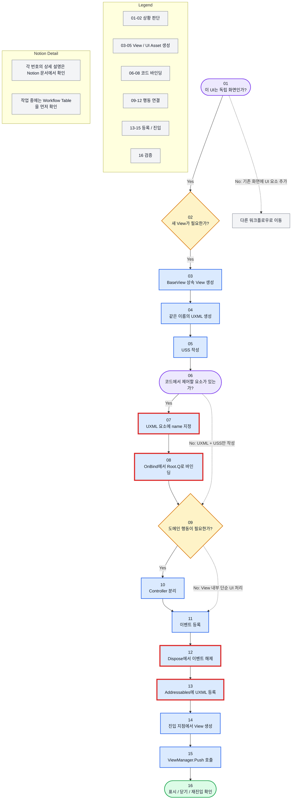

# UI Workflow - 01 새 화면 추가 Mermaid 사양

## Diagram Name

`UI Workflow - 01 새 화면 추가`

## Node Rule

- 모든 노드는 번호를 가진다.
- 노드에는 번호와 짧은 단계명만 둔다.
- 상세 설명은 Notion의 같은 번호 섹션에서 관리한다.
- 위에서 아래로 읽는 세로형 사고 흐름으로 배치한다.
- Figma/FigJam을 사용하지 않아도 Notion 코드 블록과 Markdown 문서에서 원본을 유지한다.

## Role In The Page

- 실제 작업 중에는 `Workflow Table`을 먼저 본다.
- Mermaid는 전체 흐름 확인과 외부 도구 이동을 위한 보조 원본이다.
- 노드 번호, Workflow Table 번호, 상세 섹션 번호는 항상 일치해야 한다.

## Node List

```txt
01 이 UI는 독립 화면인가?
02 새 View가 필요한가?
03 BaseView 상속 View 생성
04 같은 이름의 UXML 생성
05 USS 작성
06 코드에서 제어할 요소가 있는가?
07 UXML 요소에 name 지정
08 OnBind에서 Root.Q로 바인딩
09 도메인 행동이 필요한가?
10 Controller 분리
11 이벤트 등록
12 Dispose에서 이벤트 해제
13 Addressables에 UXML 등록
14 진입 지점에서 View 생성
15 ViewManager.Push 호출
16 표시 / 닫기 / 재진입 확인
```

## Mermaid Source



## Mermaid Usage Status

Figma/FigJam 생성은 보류한다.
Notion 페이지와 로컬 Markdown 문서에서 Mermaid 원본을 관리한다.
